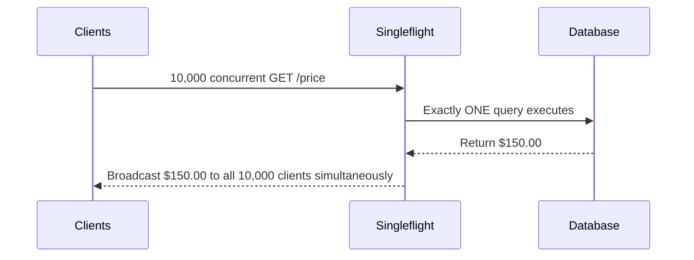

# Ferrox-Bid: Architecture & Design

`ferrox-bid` is the flagship demonstration of the `ferrox-java` ecosystem. It is a high-frequency trading / bidding engine that showcases how to survive extreme concurrency scenarios.

---

## 1. The Cache Stampede Problem

In a real-time auction, the last 10 seconds are critical. Thousands of users might trigger a browser refresh or a polling script to get the latest `currentHighestBid`.

If 10,000 HTTP requests hit the `/api/v1/auctions/auc-123/price` endpoint simultaneously:
1. The web server spins up 10,000 threads.
2. The ORM attempts to acquire 10,000 database connections.
3. The Database Connection Pool (usually capped at 10-50 connections) is instantly exhausted.
4. The remaining 9,950 threads block, timing out. The application crashes.

This is known as a **Cache Stampede** or **Dogpiling**.

---

## 2. The Ferrox-Bid Solution

`ferrox-bid` implements the **Singleflight** pattern natively. 

When the 10,000 requests arrive, they are routed through the `GetAuctionPriceHandler` via the CQRS `QueryBus`. 

### Why Virtual Threads matter here
While 9,999 requests are "waiting" for the single database query to finish, they do not consume OS threads. Java 21 **Virtual Threads** park these requests in the heap (consuming mere kilobytes of RAM instead of megabytes of OS thread stacks). 

---

## 3. CQRS Implementation

`ferrox-bid` strictly separates concerns:

- **Writes (`PlaceBidCommand`):** Handled by `PlaceBidHandler`. This is a synchronized, transactional operation. It checks the database to ensure the incoming bid amount is strictly greater than the current highest bid, and that the `endTime` has not passed.
- **Reads (`GetAuctionPriceQuery`):** Handled by `GetAuctionPriceHandler`. This is a non-blocking, singleflighted operation designed for infinite horizontal scalability.

---

## 4. Verification

To mathematically prove the architecture, `ferrox-bid` includes `run-load-test.ps1`.
This PowerShell script uses `Start-ThreadJob` to fire 500 parallel requests at the exact same millisecond. 

By observing the Spring Boot logs, developers can verify that `ferrox-bid` executes exactly **one** database fetch operation, while successfully returning the HTTP 200 OK response to all 500 clients.
